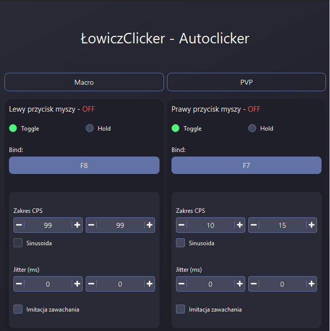

# ⛏️ Minecraft Auto Clicker & Automation Tool (Qt C++)

A desktop automation tool designed for Minecraft gameplay enhancement, featuring advanced clicking patterns, configurable automation modes, and a built-in license validation system.

---

## ⚙️ Features

### 🖱️ Advanced Auto Clicking
- Adjustable CPS (Clicks Per Second)
- Multiple clicking modes:
  - Constant clicking
  - Randomized jitter clicking
  - Sinusoidal click variation (wave-based CPS fluctuation)
- Human-like behavior simulation to reduce pattern predictability

---

### 🎮 Minecraft Automation Features
- Gameplay-oriented automation presets
- Configurable timing profiles
- Optimized for in-game usage scenarios

---

### 🔐 License System
- Built-in license verification system
- Key-based authentication
- Time-limited licenses (expiry-based access)
- Encrypted internal key validation logic
- Prevents unauthorized usage outside licensed environment

---

## 🎨 UI / UX
- Clean Qt-based interface
- Dark theme optimized for long usage
- Simple controls for fast configuration
- Real-time status feedback

---

## 🛠️ Technologies
- C++
- Qt (Widgets)
- QTimer / event-driven architecture
- Custom encryption / key validation logic

---

### License System
Access is controlled using:
- Unique license keys
- Internal encryption validation
- Expiration date checks
- Time-based access enforcement

---

## 📌 Notes

This project was developed as a study of:
- Qt application development
- Input automation systems
- Basic cryptographic license validation concepts
- UI/UX design for desktop tools

---

## 📸 Screenshots

### Main Window

---

## ⚠️ Disclaimer

This tool was created for educational purposes and personal use in controlled environments.

---

## 👨‍💻 Author

Student C++ / Qt project focused on automation, UI design, and system logic.